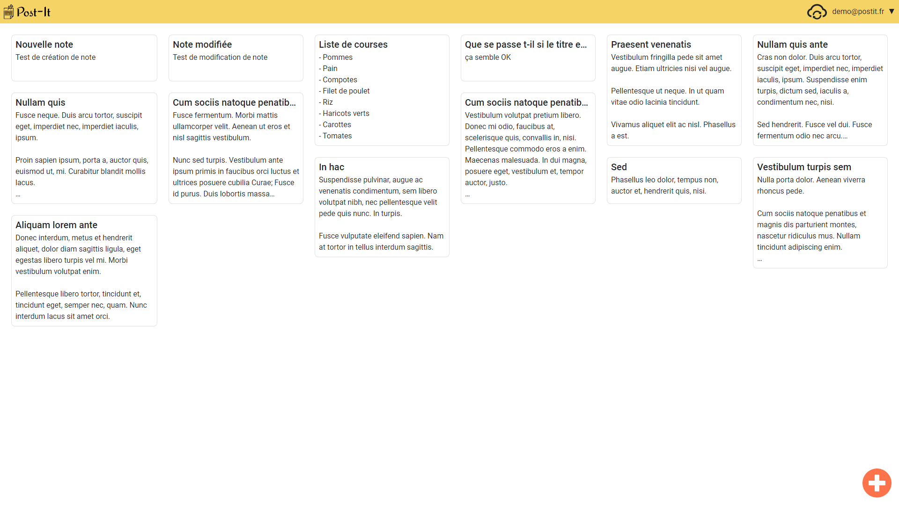

# Post-It

Post-It est une web-app responsive de gestion de notes fortement inspiré de [Google Keep](https://keep.google.com/).
Elle a été développée dans le but de mettre en pratique des connaissances acquises sur l'écosystème React à travers des MOOCs.

La web app permet de :

- Créer un compte
- Se connecter
- Créer une nouvelle note
- Modifier une note existante
- Supprimer une note

La web app se base sur [l'API Post-It](https://github.com/lsinquin/post-it-api) pour persister les données de chaque utilisateur.

## Status

La web est dans un état fonctionnel minimal. De nombreuses fonctionnalités sont encore à ajouter parmi lesquelles :

- Drag & Drop des notes
- Permettre la connexion à partir d'un compte Google, Facebook, etc..
- Modification optimiste sans attendre le retour de l'API pour fluidifier l'expérience utilisateur. Rollback en cas d'erreur.
- Permettre de choisir une couleur pour chaque note.
- Modification du mot de passe d'un compte.
- Implémentation de l'écran de mot de passe oublié.

## Démo

Le web app est hébergée sur [Netlify](https://trusting-gates-880974.netlify.app/).  
Le compte suivant de démonstration peut être utilisé pour découvrir l'application sans créer de compte :

- mail : demo@postit.fr
- mot de passe : postit123

L'API Post-It est quant à elle hébergée sur [heroku](https://post-it-api.herokuapp.com/)

## Technologies

La web app utilise React pour définir les interfaces graphiques. Le choix a été fait d'utiliser massivement les functional components et d'utiliser les hooks pour gérer les états et les effets de bords.

Ce projet a été initialisé et configuré grâce à [CRA (Create React App)](https://create-react-app.dev/docs/getting-started/)

La librairie de composants [React Bootstrap](https://react-bootstrap.github.io/) a été utilisée. En plus des composants offerts par React Bootstrap, [Bootstrap (V4)](https://getbootstrap.com/docs/4.6/getting-started/introduction/) a été utilisé afin de pouvoir utiliser ses nombreuses classes utilitaires. Vu la simplicité des écrans de l'application, le système de Grid de Bootstrap a été très peu utilisé au profit de l'utilisation généralisée de flexbox.

[Axios](https://axios-http.com/) a été priviligié pour faire les appels à l'API.

Les icônes de l'application sont toutes issues de [react-icons](https://react-icons.github.io/react-icons/).

L'affichage des notes est gérée par le module [react-masonry-css](https://www.npmjs.com/package/react-masonry-css), implémentation optimisé pour React du principe de masonry qui optimise le placement d'éléments en fonction de leur hauteur et de l'espace vertical disponible.

## Gestion d'état

Le choix a été fait au début du projet de ne pas utiliser de bibliothèque de gestion d'état. La compléxité du projet ne me semblait pas nécéssité l'utilisation d'une telle bibliothèque et ça permettait de se concentrer sur l'apprentissage de React.

Les états locaux, spécifiques à un composant ont été extraits dans des [custom hooks](https://fr.reactjs.org/docs/hooks-custom.html) quand ils devenaient trop imposant pour réduire au maximum la définition des composants aux aspects graphiques

Un [custom hook](https://fr.reactjs.org/docs/hooks-custom.html) de gestion des informations de l'utilisateur s'interfaçant avec l'API Post-It pour se connecter est rendu global à toute l'application grâce à l'utlisation d'un [Contexte React](https://fr.reactjs.org/docs/context.html).

Un [custom hook](https://fr.reactjs.org/docs/hooks-custom.html) est dédié à la gestion des notes d'un utilisateur. Celui-ci s'initialise avec les informations de l'API puis permet de créer, modifier et supprimer une note en s'interfaçant avec l'API Post-It. Ce custom hook est rendu accessible à tous les composants de l'écran d'affichage des notes (visible ci-dessous) grâce à l'utilisation d'un [Contexte React](https://fr.reactjs.org/docs/context.html). L'utilisation d'un Contexte n'était pas nécessaire dans ce cas étant donné la faible compléxité de l'arbre de composants de cette écran. Cela permettait cependant de se familiariser avec cette nouvelle fonctionnalité de React.

Ce choix de ne pas utiliser de bibliothèque bien qu'enrichissant a rapidement rendu la gestion des états fastidieuse. Si c'était à refaire, je choisirais une solution plus structurée et éprouvée comme [Redux](https://redux.js.org/) ou je privilégierais une solution comme [react-query](https://react-query.tanstack.com/) pour simplifier l'interfaçage avec l'API Post-It.

## Installation

Pour utiliser la web app en local, yarn est nécessaire.

Après avoir cloné le dépôt Git. Tapez la commande suivante pour installer les dépendances :

`yarn`

Pour lancer l'application, tapez la commande :

`yarn start`

Pour bundle l'application, il suffit de taper la commande :

`yarn build`
